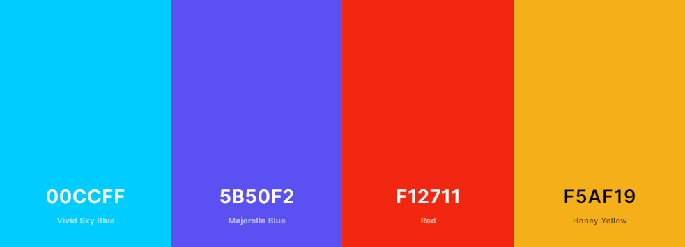
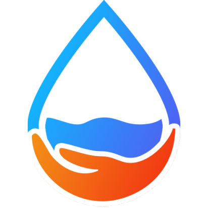
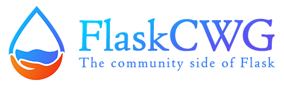
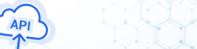

1. **Logo color palette** (`4._Logo_color_palette.psd`)

   

   | Name               | Hex code |
   | ------------------ | -------- |
   | **Vivid Sky Blue** | #00CCFF  |
   | **Majorelle Blue** | #5B50F2  |
   | **Red**            | #F12711  |
   | **Honey Yellow**   | #F5AF19  |

2. **Icon** (`3._Website_icon.psd`)

   

3. **Banner** (`2._Website_banner.psd`)

   

4. **Curated resources banners** (`1._Curated_resources_banners`)

   

